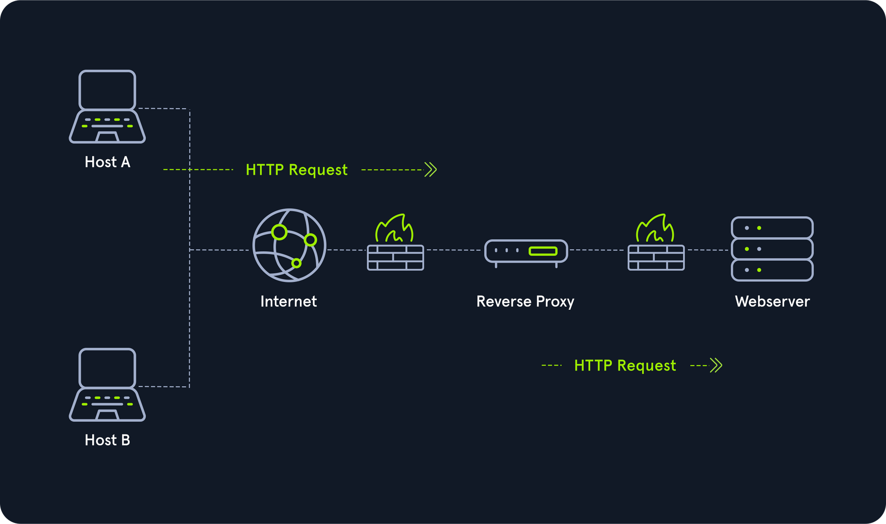

# Types of Networks

## Common Terms
- Wide Area Network (WAN) example: Internet.
- Local Area Network (LAN) example: Home or office.
	- RFC 1918
	- IP schema 10.0.0.0/8, 172.168.0.0/12, 192.168.0.0/16
- Wireless Local Area Network (WLAN) - LAN
- **VPN**:
	- Site-to-Site VPN
	- Remote Accesss VPN
	- Split tunnel VPN
	- SSL VPN

## Book Terms
- Global Area Network (GAN) example: Internet
- Metropolitan Area Network (MAN) example: Regional Network
- Wireless Personal Area Network (WPAN) exmaple: Bluetooth (piconet)
- IOT

# Topologies
- A network topology is a typical arrangement and physical or logical connection of devices in a network.
- The t**ransmission medium layout** used to connect devices is the physical topology of the network. For conductive or glass fiber media, this refers to the cabling plan, the positions of the nodes, and the connections between the nodes and the cabling. In contrast, the logical topology is how the signals act on the network media or how the data will be transmitted across the network from one device to the devices' physical connection.

## Topology can be divided into three (3) areas
1. Connections

2. Nodes - Network Interface Controllers (NICs)

Network nodes are the transmission medium's connection points to transmitters and receivers of electrical, optical, or radio signals in the medium.

3. Classification:
	1. Point-to-point: Direct physical connection between 2 endpoints.
	
	
	2. Bus: All endpoints are directly connected with transmission medium. Has no central networking component. **Since the medium is shared with all the others, only one host can send, and all the others can only receive and evaluate the data and see whether it is intended for itself.**
	
	
	3. Star: The star topology is a network component that maintains a connection to all hosts. Each host is connected to the central network component via a separate link. This is usually a router, a hub, or a switch. These handle the forwarding function for the data packets. To do this, the data packets are received and forwarded to the destination. The data traffic on the central network component can be very high since all data and connections go through it.
	
	
	4. Ring: The physical ring topology is such that each host or node is connected to the ring with two cables:
	   - One for the incoming signals and
	   - the another for the outgoing ones.
   - A logical ring topology is based on a physical star topology, where a distributor at the node simulates the ring by forwarding from one port to the next. [See More](https://www.javatpoint.com/what-is-a-ring-topology)

	5. Mesh: Many nodes decide about the connections on a physical level and the routing on a logical level in meshed networks. Therefore, meshed structures have no fixed topology. There are two basic structures from the basic concept: the fully meshed and the partially meshed structure.
	- Each host is connected to every other host in the network in a fully meshed structure. This means that the hosts are meshed with each other. This technique is primarily used in WAN or MAN to ensure high reliability and bandwidth.
	- In this setup, important network nodes such as routers could be networked together. If one router fails, the others can continue to work without problems, and the network can absorb the failure due to the many connections.
	- In the partially meshed structure, the endpoints are connected by only one connection. In this type of network topology, specific nodes are connected to exactly one other node, and some other nodes are connected to two or more other nodes with a point-to-point connection.
	

	6. Tree: The tree topology is an extended star topology that more extensive local networks have in this structure. This is especially useful when several topologies are combined. This topology is often used, for example, in larger company buildings.
	- There are both logical tree structures according to the spanning tree and physical ones. Modular modern networks, based on structured cabling with a hub hierarchy, also have a tree structure. Tree topologies are also used for broadband networks and city networks (MAN).

	
	7. Hybrid: 

	8. Daisy Chain: In the daisy chain topology, multiple hosts are connected by placing a cable from one node to another. Since this creates a chain of connections, it is also known as a daisy-chain configuration in which multiple hardware components are connected in a series.
	- This type of networking is often found in automation technology (CAN).

# Proxies
A proxy is when a device or service sits in the middle of a connection and acts as a mediator. The mediator is the critical piece of information because it means the device in the middle must be able to inspect the contents of the traffic. 
- proxies will almost always operate at Layer 7 of the OSI Model.
- Main **Types of Proxies**:
	- **Dedicated / Forward:** A Forward Proxy is when a client makes a request to a computer, and that computer carries out the request.
		- Filters outgoing traffic/requests.
		
		
  - **Reverse** : Filters incoming traffic/request.
	  - The most common goal with a Reverse Proxy, is to listen on an address and forward it to a closed-off network.
	
	
  -  **Transparant**: With a transparent proxy, the client doesn't know about its existence. The transparent proxy intercepts the client's communication requests to the Internet and acts as a substitute instance. To the outside, the transparent proxy, like the non-transparent proxy, acts as a communication partner.

