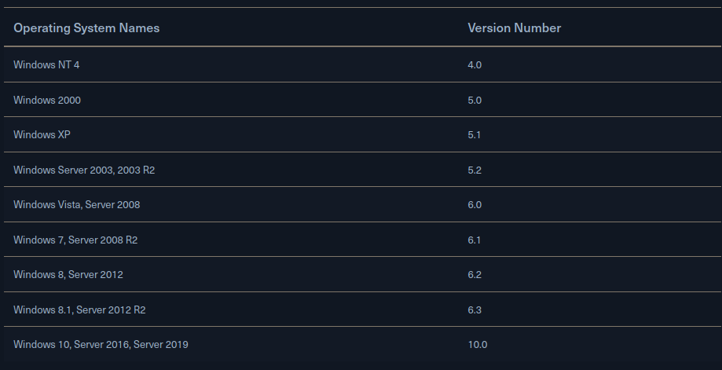

# Introduction
- Microsoft first introduced the Windows operating system on November 20, 1985. The first version of Windows was a graphical operating system shell for MS-DOS.
- Windows 95 was the first full integration of Windows and DOS and offered built-in Internet support for the first time.
- Windows Server was first released in 1993 with the release of Windows NT 3.1 Advanced Server.
- With the release of Windows 2000, Microsoft debuted Active Directory, originally intended to help sysadmins set up file sharing, data encryption, VPNs, etc. Windows Server 2000 also included the Microsoft Management Console (MMC) and supported dynamic disk volumes.
- Windows Server 2003 came next with server roles, a built-in firewall, the Volume Shadow Copy Service, and more.
- Windows Server 2008 included failover clustering, Hyper-V virtualization software, Server Core, Event Viewer, and major enhancements to Active Directory.
- Major Versions of Windows
	
-  [Difference Betwen Win10 Home & Pro](https://www.microsoft.com/en-us/windows/compare-windows-10-home-vs-pro)