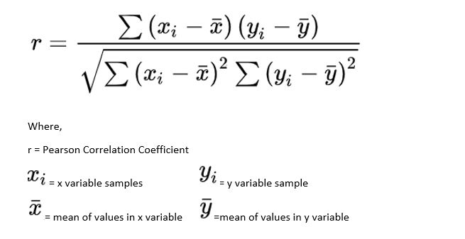
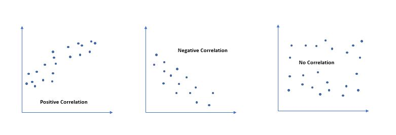
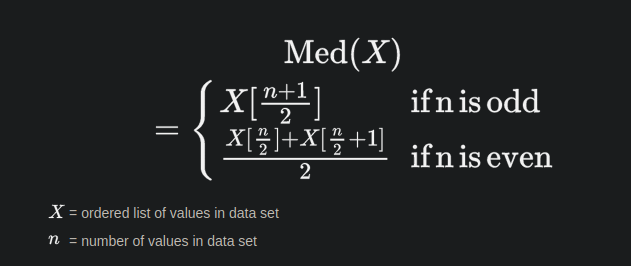

# Study Guide

1.  **Basic Concepts**:
    
    - Population and Sample
    - Variables and Data Types
    - Measures of Central Tendency: Mean, Median, Mode
    - Measures of Dispersion: Variance, Standard Deviation
    - Data Distributions: Normal Distribution, Skewed Distributions
2.  **Probability**:
    
    - Probability Theory: Sample Space, Events, Probability Axioms
    - Rules of Probability: Addition Rule, Multiplication Rule, Conditional Probability, Bayes' Theorem
    - Independence and Dependence of Events
    - Probability Distributions: Binomial Distribution, Uniform Distribution, Exponential Distribution
3.  **Descriptive Statistics**:
    
    - Data Visualization: Histograms, Box Plots, Scatter Plots
    - Summary Statistics: Percentiles, Quartiles, Interquartile Range
    - Correlation and Covariance
4.  **Statistical Inference**:
    
    - Estimation and Hypothesis Testing
    - Confidence Intervals
    - Hypothesis Testing Techniques: T-tests, Chi-Square Tests
    - P-values, Type I and Type II Errors, Statistical Power
5.  **Regression Analysis**:
    
    - Linear Regression: Simple Linear Regression, Multiple Linear Regression
    - Interpretation of Regression Coefficients
    - Model Assessment: Goodness of Fit
    - Variable Selection, Multicollinearity
6.  **Probability Distributions**:
    
    - Normal Distribution
    - Binomial Distribution
    - Poisson Distribution
    - Central Limit Theorem
7.  **Hypothesis Testing**:
    
    - Principles of Hypothesis Testing: Null and Alternative Hypotheses, Significance Level, Critical Regions
    - T-tests, Chi-Square Tests, ANOVA
    - Interpretation of Hypothesis Test Results
8.  **Experimental Design**:
    
    - Experimental Design Principles: Randomization, Control Groups, Treatment Groups
    - Confounding Variables, Sampling Methods, Bias
    - Randomized Controlled Trials, Factorial Designs
9.  **Multivariate Analysis**:
    
    - Correlation Analysis
    - Factor Analysis
    - Cluster Analysis
    - Principal Component Analysis (PCA)
    - Dimensionality Reduction: Feature Extraction, Feature Selection
10. **Statistical Software**:
    
    - Python Libraries: NumPy, Pandas, SciPy
    - R Packages: dplyr, ggplot2, caret
11. **Additional Resources**:
    
    - Books: "The Elements of Statistical Learning" by Trevor Hastie, Robert Tibshirani, and Jerome Friedman; "Introduction to Probability" by Joseph K. Blitzstein and Jessica Hwang
    - Online Courses and Tutorials: Coursera, edX, Khan Academy
    - Practice Projects and Exercises to Apply Your Knowledge

* * *

# [Pearson's Coefficient for Correlation Analysis](https://www.analyticsvidhya.com/blog/2021/01/beginners-guide-to-pearsons-correlation-coefficient/)

Pearson’s Correlation coefficient is represented as ‘**r**’, it measures how strong is the linear association between two continuous variables using the formula:
                                                

## Values of Pearson's Coefficient

Value of ‘r’ ranges from ‘-1’ to ‘+1’. Value ‘0’ specifies that there is no relation between the two variables. A value greater than ‘0’ indicates a positive relationship between two variables where an increase in the value of one variable increases the value of another variable. Value less than ‘0’ indicates a negative relationship between two variables where an increase in the value of one decreases the value of another variable.

**Value of ‘r’ closer to the ‘0’ data points is around the line of best fit.**

                          

29/05/2023 17:04

* * *
# Basics Concepts
## Population & Sample
- **Population**: Represents every individual element that we are interested in measuring.
- **Sample**: A portion of a population.
- **A sample is representative of a population if the characteristics of the individuals in the sample closely matches the characteristics of the individuals in the overall population**.
- **Sampling Techniques**:
	- **Probability Sampling**:
		- **Simple random sample**: Every member of a population has an equal chance of being selected to be in the sample. Randomly select members through the use of a random number generator or some means of random selection. 
			- **Benefit**: Simple random samples are usually **representative** of the population we’re interested in since every member has an equal chance of being included in the sample.

		- **Stratified random sample**: Split a population into groups. Randomly select some members from each group to be in the sample.
			- **Benefit:** Stratified random samples ensure that members from each group in the population are included in the survey.

		- **Cluster random sample**: Split a population into clusters. Randomly select some of the clusters and include all members from those clusters in the sample.
			- **Benefit**: Cluster random samples get every member from some of the groups, which is useful when each group is reflective of the population as a whole.

		- **Systematic random sample**: Put every member of a population into some order. Choosing a random starting point and select every nth member to be in the sample.
			- **Benefit**: Systematic random samples are usually representative of the population we’re interested in since every member has an equal chance of being included in the sample.
	- **Non-probability Sampling**:
		- **Convenience sample**: Choose members of a population that are readily available to be included in the sample.
			- **Drawback**: Location and time of day will affect the results. More than likely, the sample will suffer from undercoverage bias since certain people (e.g. those who work during the day) will not be represented as much in the sample.

		- **Voluntary response sample**: A researcher puts out a request for volunteers to be included in a study and members of a population voluntarily decide to be included in the sample or not.
			- **Drawback**: People who voluntarily respond will likely have stronger opinions (positive or negative) than the rest of the population, which makes them an unrepresentative sample. Using this sampling method, the sample is likely to suffer from **nonresponse bias** – certain groups of people are simply less likely to provide responses.

		- **Snowball sample**: Researchers recruit initial subjects to be in a study and then ask those initial subjects to recruit additional subjects to be in the study. Using this approach, the sample size “snowballs” bigger and bigger as each additional subject recruits more subjects.
			- **Drawback**: Sampling bias is likely to occur. Because initial subjects recruit additional subjects, it’s likely that many of the subjects will share similar traits or characteristics that might be unrepresentative of the larger population under study. Thus, findings from the sample can’t be extrapolated to the population.

		- **Purposive sample**: Researchers recruit individuals based on who they think will be most useful based on the purpose of their study.
			- **Drawback**: The individuals in the sample are unlikely to be representative of the overall population. Thus, findings from the sample can’t be extrapolated to the population.

## Statistic & Parameter
- A **statistic** is a number that describes some characteristic of a sample.
- A **parameter** is a number that describes some characteristic of a population.

## Graphs & When to use it

[Types of Graphs for visualization](https://www.analyticsvidhya.com/blog/2021/12/12-data-plot-types-for-visualization/)

- Qualitative/Categorical Data:
    - **Pie Chart**: What % of a total, a category represents.
    - **Dot Plot**: Suitable for understanding/compare dot plots.
- Quantative/Numeric data:
    - **Bar Graph**: Perfect for understanding figures.
    - **Histogram**: Represents frequency of different representatives. it can convey 2 information such as-
        - **Density**: The height of the bar tells how many subjects there are for one unit on the horizental scale.
        - **Percentage**: Area = percentage = height x width.
    - **Boxplot**: It conveys 5 key information.
        - Max value.
        - Min value.
        - Median.
        - Quartile. 1st & 3rd.
    - **Scatterplot**: Shows relation between 2 variables.

## Central Tendency
- ### **Mean**
	- The mean is the sum of all values divided by the number of values.
	- Use the mean when the data is normally distributed or follows a symmetric distribution.
	- It is sensitive to outliers, so if there are extreme values that do not represent the typical behavior of the data, the mean can be skewed.
	- As values increase or decrease, the mean will be influenced by the magnitude of those values. Outliers or extreme values can significantly affect the mean, pulling it towards their direction.
    - **Sample**: x = Σxi / n
    - **Population**: µ = ∑X / N

- ### **Median**: Number which is larger than half and smaller than half.
	- The median is the middle value in an ordered dataset.
	- Use the median when the data is skewed or contains outliers.
	- It is less affected by extreme values compared to the mean.
	- It is commonly used when dealing with ordinal data or when the distribution is not symmetric.
	- The median is not affected by the exact values of the data, only by their order. Changes in individual values within the dataset, as long as they do not change the order of the dataset, will not impact the median.
	- 

-  ### **Mode**: Occurs frequently on the dataset.
	- The mode is the value that appears most frequently in the dataset.
	- Use the mode when dealing with categorical or discrete data.
	- It is helpful in identifying the most common category or finding the peak of a distribution.
	- In some cases, there may be multiple modes (bimodal or multimodal distributions).
	- Changes in individual values do not impact the mode unless they affect the frequency of a particular value. The mode remains the same unless a different value becomes more frequent.
- ### **Percentiles**: A value, below which a certain percentage of data falls.
    - **General Rule**: if value X is at the kth percentile, then X is greater than K% of the values. [Source](https://statisticsbyjim.com/basics/percentiles/)
    
    - **Rank**: rank of a value is the percentage of values in the dataset that are less than or equal to that value. For example, if your score on a test is in the 90th percentile, it means you scored better than 90% of the other test-takers (ChatGPT) 
		-  **Formula**: PR = (Number of values ≤ X) / (Total number of values) * 100

    - **Percentile**: A percentile is a specific value below which a certain percentage of the data falls. For example, if you're in the 75th percentile on a height chart, it means you're taller than 75% of the people.
		- **Formula**: n = (k/100) * (Total number of values + 1)
		 where,
			n = Position
			k = desired percentile

    - **Interquartile Range (IQR)**: The interquartile range is a measure of the spread of the data. It is calculated as the difference between the 75th percentile (Q3) and the 25th percentile (Q1). It gives you an idea of the range within which the middle 50% of the data lies. (ChatGPT)
		- **Formula**: IQR = Q3 - Q1

    - **Five-Number Summary**: The five-number summary is a concise summary of the dataset. It includes the minimum value, the 25th percentile (Q1), the median (Q2 or 50th percentile), the 75th percentile (Q3), and the maximum value. (ChatGPT)

    - **Example math**: 
		-  Let's consider a dataset of exam scores: [60, 70, 75, 80, 85, 90, 95]
		-  **Percentile Rank**:
    		- Let's calculate the percentile rank for the score 80:
    PR = (Number of values ≤ 80) / (Total number of values) * 100
    PR = (4 / 7) * 100
    PR ≈ 57.14%
	This means that the score of 80 is better than approximately 57.14% of the other scores in the dataset.
		- Let's find the value at the 75th percentile:
			- Arrange the dataset in ascending order: [60, 70, 75, 80, 85, 90, 95]
			n = (75/100) * (7 + 1) ≈ 6
			The value at the 6th position is 90.
			Therefore, the 75th percentile is 90.
		- **Interquartile Range (IQR)**:
			- Q1 = 25th percentile = 75
			Q3 = 75th percentile = 90
			IQR = Q3 - Q1 = 90 - 75 = 15
			The interquartile range tells us that the middle 50% of the scores fall within a range of 15 points.
		- Five-Number Summary:
			- Minimum: 60
			 Q1: 75
			Median: 80
			Q3: 90
			Maximum: 95
			The five-number summary provides a concise description of the dataset, giving information about the range, central tendency, and spread.